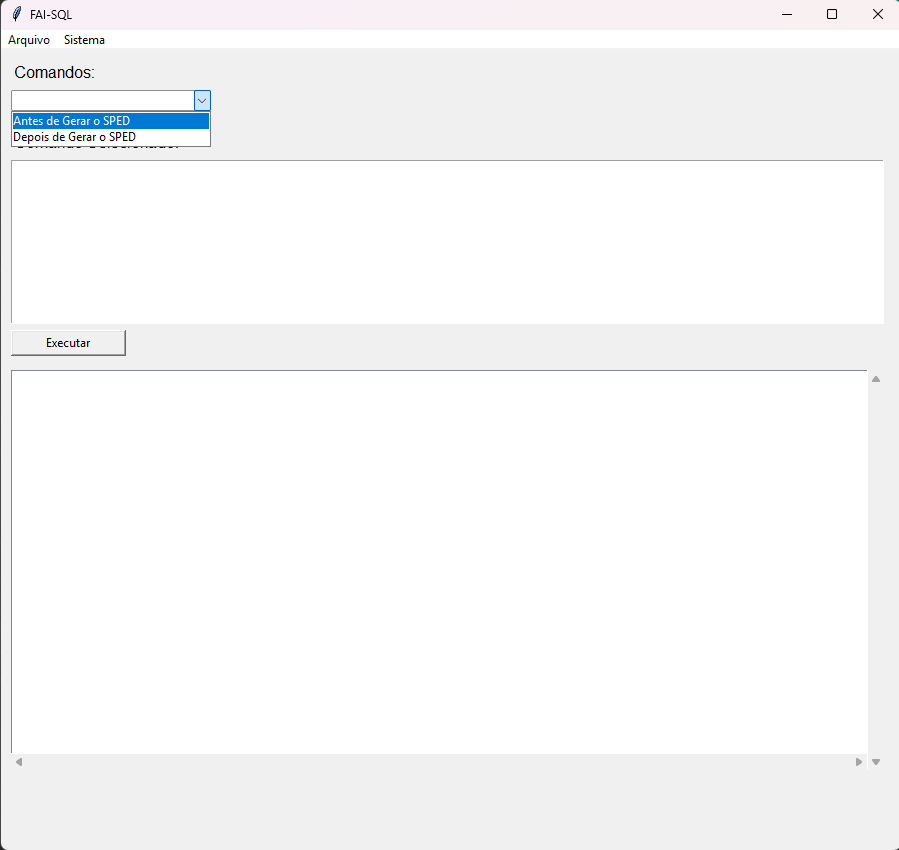
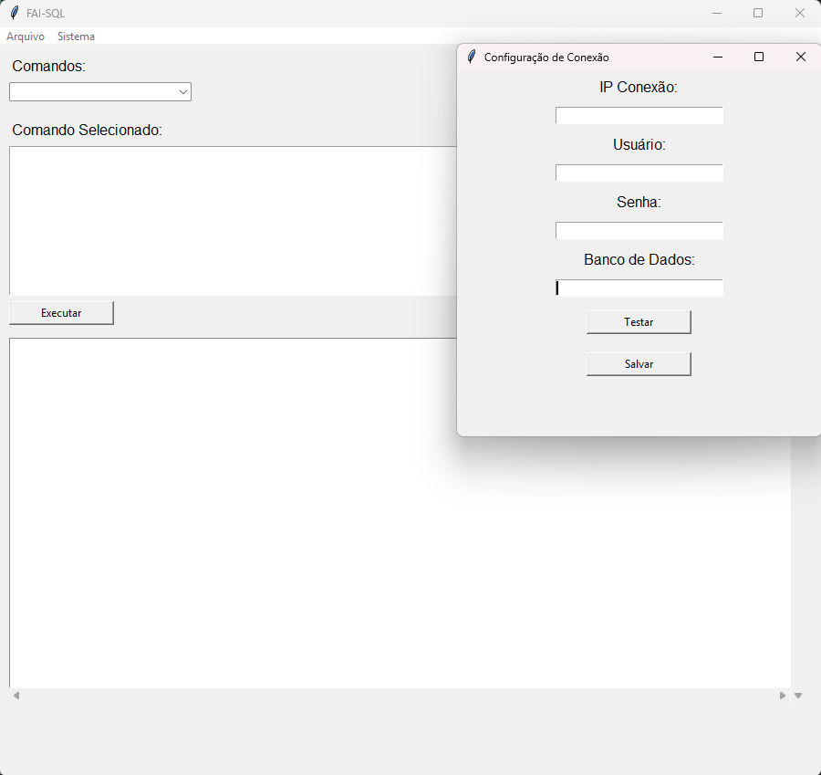
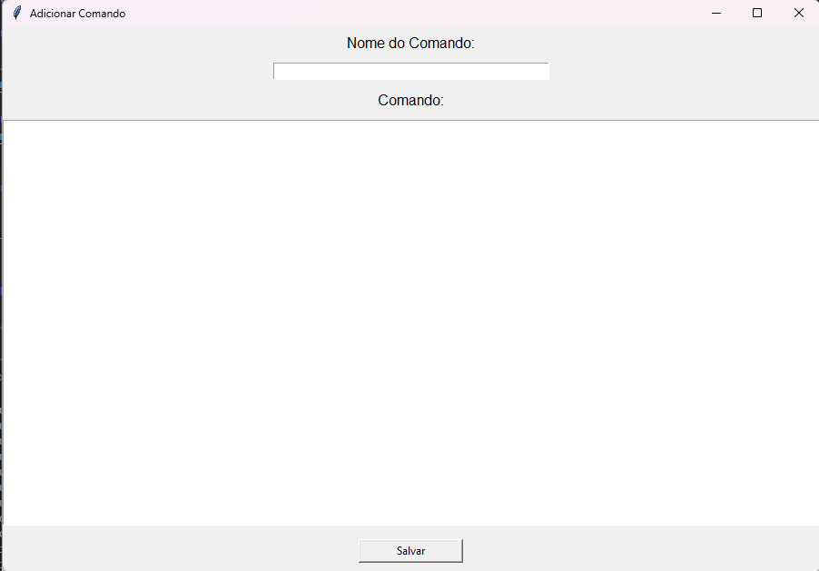

## Gerenciador de Comandos SQL Desktop

**Software para armazenamento e execução de comandos SQL recorrentes, desenvolvido com Python e Tkinter.**

## Tela inicial


## Tela de configuração de conexão


## Tela para adição de comandos

-----

### Visumo Geral

O Gerenciador de Comandos SQL Desktop é uma aplicação stand-alone desenvolvida para auxiliar desenvolvedores, DBAs e analistas a armazenarem e executarem comandos SQL de uso frequente de forma rápida e eficiente. O software elimina a necessidade de procurar ou digitar comandos repetitivos, permitindo a execução direta no banco de dados configurado e exibindo os resultados em tempo real.

### Recursos Principais

  * **Armazenamento Persistente de Comandos:** Salve múltiplos comandos SQL em um arquivo JSON local para fácil acesso e reuso.
  * **Conexão Simplificada:** Mantenha os parâmetros de conexão do banco de dados salvos em um arquivo JSON separado, permitindo a troca rápida de ambiente, se necessário.
  * **Execução com Um Clique:** Selecione um comando salvo na interface principal e execute-o diretamente no banco de dados configurado.
  * **Comandos Livres:** Execute comandos SQL avulsos, digitados diretamente na tela, para consultas e operações não salvas.
  * **Visualização de Resultados:** O resultado da execução (tabela de dados, mensagem de sucesso ou erro) é exibido em um painel dedicado na tela principal.
  * **Interface Gráfica Intuitiva:** Desenvolvido com Tkinter para uma experiência de usuário desktop simples e direta.

### Tecnologias Utilizadas

  * **Linguagem:** Python
  * **Interface Gráfica:** Tkinter
  * **Gerenciamento de Dependências:** `pip`
  * **Build do Executável:** PyInstaller

-----

### Instalação e Execução

Para rodar o projeto localmente ou construir o executável, siga os passos abaixo.

#### Pré-requisitos

  * Python 3.x instalado.
  * pyinstaller
  * pyodbc
  * **Instalação das Dependências:**
    ```bash
    pip install pyinstaller # Necessário para criar o executável
    pip install pyodbc
    ```

#### Execução Local (do Código Fonte)

1.  Clone o repositório para sua máquina:
    
2.  Execute o script principal:
    ```bash
    python main.py 
    ```

-----

### Build do Aplicativo (`.exe` com PyInstaller)

Para gerar um arquivo executável (`.exe`) que possa ser distribuído e executado em qualquer máquina Windows sem a necessidade de instalar o Python, utilize o PyInstaller.

**Instrução de Build:**

Execute o comando abaixo no terminal, na pasta raiz do  projeto.

```bash
pyinstaller --onefile --windowed --name "FAISQL" main.py
```

| Opção | Descrição |
| :--- | :--- |
| `--onefile` | Cria um único arquivo executável, facilitando a distribuição. |
| `--windowed` | Impede que a janela do console/terminal seja exibida ao executar o aplicativo Tkinter. |
| `--name "FAISQL"` | Define o nome do executável e da especificação do build como "FAISQL". |

**Resultado:**

Após a execução, o PyInstaller criará uma pasta chamada `dist` no diretório do projeto. O arquivo executável (`FAISQL.exe`) estará dentro dessa pasta.

-----

### Estrutura de Arquivos de Configuração

O aplicativo utiliza dois arquivos JSON para persistência de dados:

1.  **`config.json`**: Armazena as credenciais e parâmetros necessários para estabelecer a conexão com o banco de dados. **Mantenha este arquivo seguro.**
2.  **`comandos.json`**: Contém a lista de comandos SQL que o usuário salvou para reutilização.

-----

### Contribuição

Sinta-se à vontade para sugerir melhorias, reportar bugs ou enviar pull requests. Qualquer contribuição é bem-vinda\!

-----


