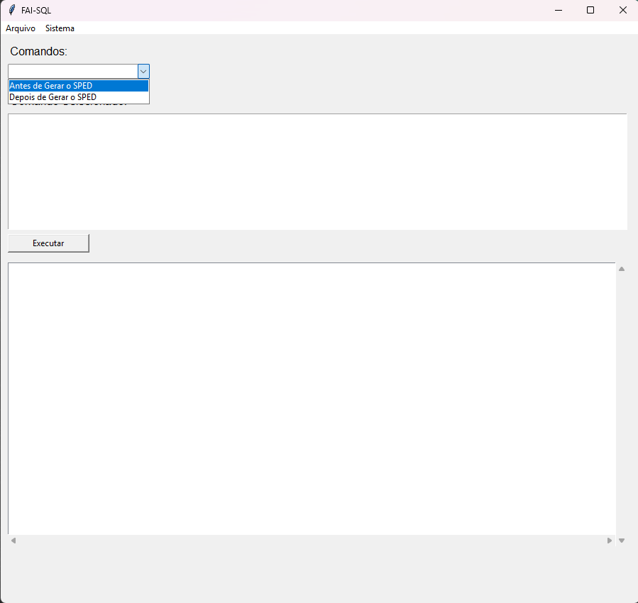

# FAI-SQL

**Gerenciador de Comandos SQL Desktop** - Software para armazenamento e execução de comandos SQL recorrentes.



---

## 📋 Recursos

- ✅ **Interface moderna** com temas claro/escuro
- ✅ **Gerenciador de múltiplas conexões** SQL Server
- ✅ **Armazenamento de comandos** SQL para reuso
- ✅ **Edição e exclusão** de comandos salvos
- ✅ **Syntax Highlighting** SQL em tempo real
- ✅ **Exportação** para CSV e Excel
- ✅ **Histórico** de comandos executados
- ✅ **Undo/Redo** (Ctrl+Z / Ctrl+Y)

---

## 🚀 Instalação

### Pré-requisitos

- Python 3.8+
- Driver ODBC do SQL Server instalado

### Passos

1. Clone o repositório:
```bash
git clone https://github.com/seu-usuario/FAI-SQL.git
cd FAI-SQL
```

2. Instale as dependências:
```bash
pip install -r requirements.txt
```

3. Crie os arquivos de configuração:
```bash
copy config.example.json config.json
copy comandos.example.json comandos.json
```

4. Execute a aplicação:
```bash
python main.py
```

---

## ⚙️ Configuração

### Conexão com Banco de Dados

1. Acesse **Sistema → Conexão**
2. Preencha os dados: Nome, Servidor/IP, Usuário, Senha, Banco
3. Clique em **Testar** para verificar
4. Clique em **Salvar** para adicionar

Você pode criar múltiplas conexões e alternar entre elas clicando em **Usar**.

### Gerenciamento de Comandos

- **Adicionar**: Sistema → Adicionar Comando
- **Editar**: Selecione um comando e clique em ✏️ Editar
- **Excluir**: Selecione um comando e clique em 🗑️ Excluir

---

## 📁 Estrutura de Arquivos

```
FAI-SQL/
├── main.py              # Aplicação principal
├── requirements.txt     # Dependências Python
├── config.json          # Configurações de conexão (não versionado)
├── comandos.json        # Comandos salvos (não versionado)
├── historico.json       # Histórico de execuções (não versionado)
├── config.example.json  # Exemplo de configuração
├── comandos.example.json # Exemplo de comandos
├── icon.ico             # Ícone da aplicação
├── docs/                # Documentação
│   ├── contexto_projeto.md
│   └── relatorio_implementacao_melhorias.md
└── dist/                # Executável (após build)
```

---

## 🎨 Temas

Alterne entre tema claro e escuro em: **Sistema → Tema Escuro/Claro**

A preferência é salva automaticamente.

---

## 📤 Exportação

Após executar um SELECT:
- Clique em **📄 CSV** para exportar como CSV
- Clique em **📊 Excel** para exportar como Excel formatado

---

## 🔨 Build (Executável)

Para criar um `.exe` distribuível:

```bash
pip install pyinstaller
pyinstaller --onefile --windowed --icon=icon.ico --name "FAISQL" main.py
```

O executável será gerado em `dist/FAISQL.exe`.

---

## 🛠️ Tecnologias

| Componente | Tecnologia |
|------------|------------|
| Linguagem | Python 3.x |
| Interface | Tkinter |
| Banco de Dados | SQL Server (pyodbc) |
| Exportação Excel | openpyxl |

---

## 📜 Licença

Este projeto está sob licença MIT.

---

## 🤝 Contribuição

Contribuições são bem-vindas! Abra uma issue ou envie um pull request.
